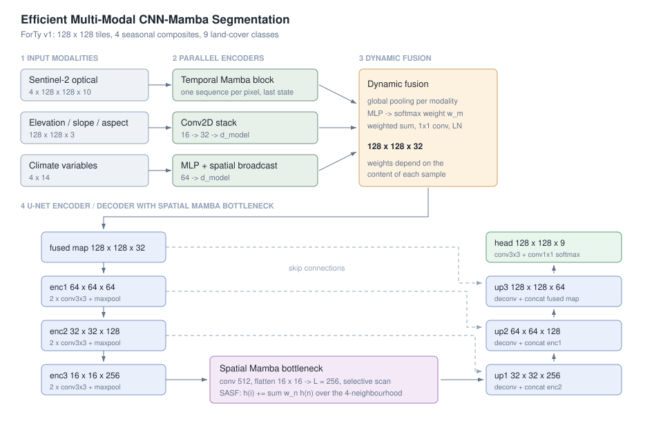

Multi-Modal CNN-Mamba for Forest Type Segmentation
=============
Welcome to the CNN-Mamba forest typology project main page!
This page is about how to run this software.

#### Install

```bash
python -m venv .venv && source .venv/bin/activate
make install                      # pip install -e .
```

#### Train

```bash
# Defaults: 128 training shards per epoch, 8 validation shards, batch size 16
make train
# or with explicit settings
python -m mamba_forest.train \
    --train-shards 128 --val-shards 8 --epochs 40 \
    --output-dir runs/mamba_forest
```

#### Evaluate

```bash
make eval
# or
python -m mamba_forest.evaluate \
    --weights runs/mamba_forest/best.weights.h5 --test-shards 64
```

#### Run Tests

```bash
make test                         # python -m pytest tests -q
```

#### Check Style

```bash
make lint                         # flake8, 88 columns
```

#### Clean the Project

```bash
make clean
```

Reading the dataset from Google Cloud Storage needs application-default
credentials (`gcloud auth application-default login`). The full usage guide,
with every flag and the files each command writes, is in
[`docs/user.md`](docs/user.md).

----------------

User page
=============
Welcome to the CNN-Mamba forest typology project user main page!

This is a deep-learning project on forest type mapping from satellite time
series. It implements an efficient multi-modal CNN-Mamba framework that
combines Sentinel-2 optical time series, climate variables and elevation data
into pixel-level segmentation of forest types, and evaluates it on the ForTy v1
benchmark. The repository contains the full pipeline: the input pipeline that
streams the dataset from Google Cloud Storage, the model, the training
objective designed for the class imbalance of the task, the training and
evaluation entry points, and the unit tests. A second implementation of the
same idea, written in JAX/Flax as a plug-in for DeepMind's JEO framework, lives
in [`jeo_plugin/`](jeo_plugin).

# Abstract

Accurate forest type classification is critical for environmental monitoring
and sustainable management. Distinguishing natural forest from planted forest
and tree crops, rather than merely separating "forest" from "non-forest", is
the part of the problem that matters for policy and the part that current
models are worst at. Formulated as pixel-level semantic segmentation, it
requires modelling spatial structure, seasonal dynamics and heterogeneous
information from several sensors at once.

This project proposes an efficient multi-modal CNN-Mamba framework. The model
combines convolutional encoders for local spatial feature extraction with
Temporal and Spatial Mamba blocks, selective state-space models that capture
long-range dependencies in linear time instead of the quadratic attention of a
transformer. A dynamic MLP-based fusion mechanism adaptively integrates the
modalities per sample, and a U-Net-style encoder-decoder with a Mamba
bottleneck reconstructs high-resolution segmentation maps. On the ForTy
dataset, trained on only 12.5% of the available data, the approach outperforms
the UNet3D and UTAE baselines and reaches competitive performance relative to
MTSViT, which shows its data efficiency under limited-resource settings.



## Dataset

[ForTy v1](https://console.cloud.google.com/storage/browser/forest_typology)
is a public forest-typology benchmark of globally sampled 128 x 128 pixel
tiles, published as 1024 TFRecord shards per split. Samples are partitioned
into geographically distinct 100 x 100 km blocks in an 8:1:1 ratio, so the
train, validation and test splits do not share spatial autocorrelation. Each
tile provides:

- **Sentinel-2 optical imagery** — 10 bands at 10-20 m resolution, as four
  seasonal composites.
- **Climate variables** — 14 TerraClimate monthly metrics at ~4 km resolution.
- **Topographic data** — FABDEM elevation, slope and aspect at 30 m resolution.
- **Segmentation labels** — a per-pixel class index over nine land-cover
  classes, of which the three forest types (natural forest, planted forest,
  tree crops) are the classes of interest.

Nothing is downloaded up front: the pipeline streams a random subset of shards
per epoch straight from Google Cloud Storage, which keeps an epoch to a few
thousand tiles and makes single-GPU experiments possible.

## Preprocessing

Because the modalities have different physical units and ranges, each is
normalised on its own terms: Sentinel-2 reflectance is scaled to [-1, 1] with a
factor of 5000, elevation is centred at 2000 m and scaled by 3000, slope by 45
degrees and aspect by 180 degrees, and each climate variable is z-scored over
the time axis of the sample. The integer masks are one-hot encoded to
128 x 128 x 9 for the categorical objective.

Augmentation is applied to the training split only. Satellite imagery is
acquired from nadir, so land-cover classes are invariant to mirroring:
horizontal and vertical flips are each applied with probability 0.5, drawn once
per sample and applied synchronously to the optical series, the elevation map
and the label mask so that the pixel-wise correspondence is preserved.
Brightness jitter with a maximum delta of 0.1 simulates illumination and
atmospheric variation and is applied to the optical modality only, since
perturbing elevation or climate would change the physical meaning of those
measurements instead of modelling sensor noise. Shards are interleaved in
parallel and prefetched with `AUTOTUNE` so the input pipeline keeps up with the
accelerator.

## Model

Here is an introduction to the five stages the network is built from.

### Parallel modality encoders

The three modalities are encoded in parallel, each in the way that suits its
structure. The optical time series of shape `[B, T, H, W, C]` is folded into
one sequence per spatial location, `[B*H*W, T, C]`, so the temporal block sees
the four seasons of a single pixel and the spatial structure is left
untouched. A **Temporal Mamba block** then compresses the phenological dynamics
into a compact representation, and its last state is reshaped back to
`[B, H, W, C]`, giving a temporally enriched optical feature map.

Elevation is treated as a spatial modality: a stack of 2D convolutions with
growing channel width projects the terrain map into the shared feature space
while preserving resolution. Climate variables are low-dimensional and have no
spatial extent, so a small MLP turns them into a modality embedding that is
broadcast over space to `[B, H, W, d_model]`, letting the climatic context
influence every pixel at negligible cost.

### Dynamic multi-modal fusion

Instead of concatenating the three feature maps, the model computes fusion
weights from their content. Each modality is pooled to a global descriptor, the
descriptors are concatenated and passed through a lightweight MLP, and a
softmax produces one weight per modality *per sample*. The weights are
broadcast spatially, applied to their feature maps, and the weighted sum is
refined by 1 x 1 convolutions and layer normalisation. A cloudy tile can
therefore lean on terrain and climate, while a clear tile leans on the optical
series.

### U-Net encoder

The hierarchical encoder is a U-Net-style downsampling path of three stages.
Each stage applies two 3 x 3 convolutions with ReLU activation and dropout,
followed by 2 x 2 max pooling. Starting from the fused map at 128 x 128, the
spatial resolution goes 128 -> 64 -> 32 -> 16 while the channel width grows
32 -> 64 -> 128 -> 256, so the encoder learns increasingly abstract spatial
representations while keeping the hierarchy available for the decoder.

### Spatial Mamba bottleneck with SASF

At the 16 x 16 bottleneck the feature map is projected to 512 channels and
flattened into a sequence of length 256. A selective state-space model with
`d_state = 16` scans that sequence, so every patch can reach every other patch
with linear rather than quadratic cost — a "global eye" that connects disjoint
forest patches across the tile.

Flattening a 2D map into a 1D sequence loses vertical adjacency: two pixels
that are neighbours in the image are a full row apart in scan order.
**Structure-Aware State Fusion (SASF)** repairs this. After the scan the
sequence is reshaped back to 16 x 16 and each state is mixed with its four
direct neighbours,

```
h_fused(i) = h(i) + sum_{n in N(i)} w_n * h(n),
```

with weights learned per direction and channel. This re-introduces a 2D
inductive bias, so the linear sequence model stays aware of the physical
spatial structure.

### Multi-stage decoder

The decoder reconstructs 16 -> 32 -> 64 -> 128 in three stages. Each begins
with a transposed convolution of stride 2, concatenates the matching encoder
feature map — `enc2`, `enc1` and the fused map respectively — and refines the
result with two 3 x 3 convolutions with dropout. The skip connections return
the fine spatial detail lost to pooling. A convolutional head with a softmax
activation produces the per-pixel class probabilities at the full 128 x 128
resolution; the head is kept in float32 so the softmax and the loss stay stable
under mixed-precision training.

## Training

The objective is a convex combination of a weighted categorical cross-entropy
and a Dice loss,

```
L = alpha * L_WCCE + (1 - alpha) * L_Dice,   alpha = 0.4,
```

which puts 40% of the weight on pixel-wise supervision and 60% on region-level
overlap. The cross-entropy term uses label smoothing of 0.05 and a per-class
weight vector that raises the cost of the rare classes, planted forest most of
all. The Dice term is computed per class and averaged over the classes present
in the batch, so a class that appears in neither the labels nor the prediction
cannot score a free perfect overlap.

Parameters are optimised with AdamW, weight decay 5e-3, from an initial
learning rate of 2e-4 under a cosine decay down to 10% of it. Gradients are
clipped to a global norm of 1.0, and mixed-precision training keeps the
compute-heavy operations in float16 with dynamic loss scaling while weights and
the output head stay in float32, which cuts memory use and speeds up training
without affecting the result.

## Results

All numbers are F1 in percent on the ForTy v1 test split: **Overall** is the
macro F1 over the nine classes, **Forests** the mean F1 of the three forest
types, and **N**, **P** and **TC** the F1 of natural forest, planted forest and
tree crops.

| Model | Overall | Forests | N | P | TC |
|---|---:|---:|---:|---:|---:|
| UNet3D | 32.4 | 24.2 | 56.2 | 7.5 | 8.8 |
| UTAE | 49.4 | 37.7 | 71.4 | 13.8 | 27.8 |
| MTSViT | 81.1 | 74.9 | 82.8 | 62.9 | 78.9 |
| **CNN-Mamba (this repository)** | **56.89** | **48.81** | **64.67** | **27.64** | **54.12** |

The baselines are trained on the full training split; this model is trained on
128 of the 1024 shards, about 12.5% of the data. Under that budget it improves
on UNet3D and UTAE in every column, with the clearest gains on the two classes
the benchmark finds hardest — planted forest and tree crops — and stays behind
MTSViT, which sees eight times as much training data. The combination of a
weighted cross-entropy with the Dice term is what makes those rare classes
trainable: with a plain unweighted cross-entropy the validation metrics swing
between epochs and the under-represented classes collapse into natural forest
and other vegetation.

More detail, including the training configuration and how to reproduce the
numbers, is in [`results/README.md`](results/README.md).

## Mapping your own region

The benchmark says how good the model is; this is how you point it at your own
imagery. Give it a directory of tiles and it returns a forest-type map per tile
plus a table of what is in them:

```bash
make predict TILES=my_tiles OUT=predictions
```

Each tile is one `.npz` file holding three unnormalised arrays — `s2`
`(4, H, W, 10)` Sentinel-2 seasonal composites, `elevation` `(H, W, 3)` in
metres and degrees, and `climate` `(4, 14)` — with `H = W` divisible by 8.
`predict.py` applies exactly the same normalisation as the training pipeline,
so there is no second copy of the scaling constants to drift.

You get back `<tile>_class_map.npy` with the nine class indices per pixel, an
optional colour-coded PNG, and `predictions.csv` with the pixel share of every
class per tile plus the combined `forest_share`. That last table is what turns
the model into an answer: average the shares over the tiles covering a
concession to get its composition, or subtract the class maps of two years to
separate *natural forest converted to tree crops* from *natural forest cleared
to bare ground* — a distinction a binary forest mask cannot make, because in
the first case the canopy is still there.

The full contract — array shapes, units, band order, what each output file
holds, and how to retarget the model to a different taxonomy — is in
[`docs/apply.md`](docs/apply.md).

----------------

Developer page
=============
Welcome to the CNN-Mamba forest typology project developer main page!

----------------
## Abstract

The repository is organised as a small installable package plus two entry
points. `src/mamba_forest/` holds the TensorFlow implementation: `data.py`
streams and preprocesses ForTy v1, `layers.py` holds the three building blocks
(the selective state-space block, SASF and the dynamic fusion layer),
`model.py` assembles them into the segmentation network, `losses.py` defines
the training objective, and `train.py` and `evaluate.py` are the command-line
entry points. `jeo_plugin/` holds a second, independent implementation in
JAX/Flax that plugs into DeepMind's JEO framework. `tests/` covers the blocks,
the network and the objective, and `docs/` holds the pages below.

For more information about the software, select the following pages.

----------------
## [Developer Overview](docs/developer.md)

The layout of the repository, the path a batch takes through it, and where to
start for the change you have in mind.

## [Mapping Your Own Region](docs/apply.md)

The input contract for your own tiles, what the prediction run writes, and how
to turn the class shares into a composition or a change map.

## [Programming Reference](docs/reference.md)

The module-by-module map of the package: what each file provides, the public
classes and functions, their arguments and the tensor shapes they expect.

## [High-level Design](docs/design.md)

The architecture in detail, with the equations of the selective state-space
recurrence, the design decisions behind the fusion and the bottleneck, and the
data flow diagram.

## [Coding Style](docs/coding.md)

The style the code follows and how to check it.

## [Common Tasks](docs/tasks.md)

How to extend the project: add a modality, swap the backbone, change the
objective, or run on a different dataset.

## [Testing](docs/testing.md)

The testing strategy, what each test covers and how to run the suite.

----------------
## Repository layout

```
.
├── src/mamba_forest/         # TensorFlow implementation
│   ├── data.py               # ForTy v1 streaming, normalisation, augmentation
│   ├── layers.py             # Mamba block, SASF, dynamic multi-modal fusion
│   ├── model.py              # CNN-Mamba U-Net segmenter
│   ├── losses.py             # weighted cross-entropy + Dice objective
│   ├── train.py              # training loop, metrics, checkpointing
│   ├── evaluate.py           # test-split evaluation
│   └── predict.py            # apply a checkpoint to your own tiles
├── jeo_plugin/               # JAX/Flax implementation for JEO
│   ├── mamba_mtst.py         # Mamba-MTST model
│   ├── configs/              # JEO training config
│   ├── pp/                   # ForTy v1 preprocessing ops
│   └── tests/                # shape, causality and gradient tests
├── tests/                    # unit tests for the TensorFlow track
├── docs/                     # developer documentation and figures
├── scripts/plot_results.py   # training curves from the metrics CSV
├── results/                  # benchmark numbers and run configuration
└── Makefile                  # install / train / eval / predict / test / lint
```

## References

1. Gu, A., & Dao, T. (2023). *Mamba: Linear-Time Sequence Modeling with
   Selective State Spaces.* [arXiv:2312.00752](https://arxiv.org/abs/2312.00752)
2. Jiang, Y., & Neumann, M. (2025). *Not Every Tree Is a Forest: Benchmarking
   Forest Types from Satellite Remote Sensing.*
   [arXiv:2505.01805](https://arxiv.org/abs/2505.01805)
3. Ronneberger, O., Fischer, P., & Brox, T. (2015). *U-Net: Convolutional
   Networks for Biomedical Image Segmentation.*
   [arXiv:1505.04597](https://arxiv.org/abs/1505.04597)
4. Wang, Z., Zheng, J.-Q., Zhang, Y., Cui, G., & Li, L. (2024). *Mamba-UNet:
   UNet-like Pure Visual Mamba for Medical Image Segmentation.*
   [arXiv:2402.05079](https://arxiv.org/abs/2402.05079)
5. Xiao, C., Li, M., Zhang, Z., Meng, D., & Zhang, L. (2025). *Spatial-Mamba:
   Effective Visual State Space Models via Structure-Aware State Fusion.*
   [arXiv:2410.15091](https://arxiv.org/abs/2410.15091)

ForTy v1 and the JEO framework are released by Google DeepMind under Apache
2.0.

## License

MIT — see [LICENSE](LICENSE).
