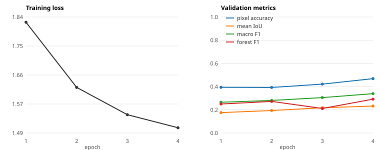

# Mamba for Multimodal Forest Mapping

Selective state-space models (Mamba) applied to satellite time series for
forest-type segmentation, as an alternative to the transformer encoders that
dominate this task.

The setting is deliberately awkward for transformers: each training example is
a 128×128 km-scale tile with a *short* time series (4 seasonal composites) from
several sensors, and the classes of interest — planted forest, tree crops — are
rare and easily confused with natural forest. A transformer spends quadratic
attention on a 4-step sequence and still has to be told how to mix modalities;
a state-space model processes the sequence in linear time with a state whose
decay is *input-dependent*, which is a better fit for "did this pixel change
between seasons, and how fast".

Two implementations are included:

| Track | Framework | What it is |
|---|---|---|
| [`src/mamba_forest/`](src/mamba_forest) | TensorFlow / Keras | Standalone Mamba-2 U-Net segmenter. This is the track that was actually trained; the numbers below come from it. |
| [`jeo_plugin/`](jeo_plugin) | JAX / Flax | Mamba-MTST encoder written as a plug-in for [JEO](https://github.com/google-deepmind/jeo), DeepMind's geospatial training framework. |

## Data

[ForTy v1](https://console.cloud.google.com/storage/browser/forest_typology)
(forest typology), a public dataset of globally sampled 128×128 pixel tiles,
published as 1024 TFRecord shards per split. Each tile provides:

- `s2` — Sentinel-2 optical, 4 seasonal composites × 10 bands
- `s1_asc` / `s1_desc` — Sentinel-1 radar, ascending and descending passes
- `elevation` — elevation, slope and aspect
- `climate` — 14 climate variables per season
- `segmentation_labels` — per-pixel class index over 9 land-cover classes

The TensorFlow track uses optical, elevation and climate; the JAX track also
takes the two radar modalities.

Nothing is downloaded up front: the pipeline streams a random subset of shards
per epoch straight from Google Cloud Storage, which keeps an epoch to a few
thousand tiles and makes single-GPU experiments possible.

## Method

**Selective SSM block.** Both tracks keep a state of size `d_state` per
sequence and update it with a decay that is computed from the input, which is
what makes the state space *selective*: the model can hold on to a slow signal
(a stable canopy) while reacting to a fast one (a clear-cut between two
seasons).

The TensorFlow block (`src/mamba_forest/layers.py`) uses the Mamba-2 style
convex update, with a decay and input/output projections of state width R:

```
alpha_t = exp(-exp(A) * softplus(W_dt s_delta(x_t)))      # forget gate, per state dim
h_t     = alpha_t * h_{t-1} + (1 - alpha_t) * B(x_t) x_t  # selective state update
y_t     = C(x_t) h_t + D * conv(x)_t                      # input-dependent readout
```

The JAX block (`jeo_plugin/mamba_mtst.py`) follows the original Mamba
discretisation, with one state per inner channel:

```
h_t = exp(delta_t A) h_{t-1} + delta_t B(x_t) x_t
y_t = C(x_t) h_t + D * conv(x)_t
```

In both cases the recurrence is a plain scan (`tf.scan` / `jax.lax.scan`)
rather than the fused CUDA kernel of the reference implementation: portable,
and fast enough for 4-step sequences.

**Segmentation model** (`src/mamba_forest/model.py`):

1. *Temporal encoding.* The optical tile is transposed and folded into one
   sequence per pixel (`[B, T, H, W, C] → [B, H, W, T, C] → [B·H·W, T, C]`)
   and passed through a temporal Mamba block; the climate series gets its own
   block and is broadcast over space.
2. *Fusion.* Optical, elevation and climate maps are projected to a common
   width and combined by a small attention MLP that emits one softmax weight
   per modality **per sample**, so a cloudy tile can lean on radar-free cues
   such as terrain instead of a fixed learned blend.
3. *U-Net with a Mamba bottleneck.* Three down-sampling blocks, then the 4×4
   bottleneck grid is flattened into a 16-step sequence and mixed by a spatial
   Mamba block — a cheap way to give every patch a view of the whole tile —
   followed by three up-sampling blocks with skip connections.
4. *Loss.* Cross-entropy, or a cross-entropy + soft-Dice combination
   (`--loss combo`) that upweights the rare classes.

## Results

Training run recorded in this repository: 32 training shards and 2 validation
shards per epoch, batch size 16, AdamW at 1e-4, cross-entropy loss, on a single
Colab GPU (~2.5 minutes per epoch). The run was stopped after 4 completed
epochs, so these are early-training numbers, not a converged model — and it
predates two fixes described under [Known limitations](#known-limitations), so
it measures an earlier version of the model
(details in [`results/README.md`](results/README.md)):

| Epoch | Train loss | Val pixel acc. | Val mean IoU | Macro F1 | Forest F1 |
|---:|---:|---:|---:|---:|---:|
| 1 | 1.8213 | 0.3940 | 0.1758 | 0.2649 | 0.2502 |
| 2 | 1.6244 | 0.3927 | 0.1941 | 0.2807 | 0.2726 |
| 3 | 1.5418 | 0.4216 | 0.2175 | 0.3053 | 0.2111 |
| 4 | 1.5024 | 0.4685 | 0.2325 | 0.3392 | 0.2918 |



Raw numbers: [`results/training_results.csv`](results/training_results.csv).

What the run does and does not show: the loss falls steadily, pixel accuracy
goes from 0.39 to 0.47 and mean IoU rises by a third, so the architecture
trains; but one of the three forest classes never leaves an F1 of ~0 (column
`f1_class_2` in the CSV), the expected failure mode for a rare class under
plain cross-entropy — which is what the Dice combination (`--loss combo`) is
meant to address. No test-split evaluation was run, and there is no transformer
baseline trained under the same budget, so the "Mamba vs. transformer"
question this project set out to probe is still open.

## Repository layout

```
.
├── src/mamba_forest/         # TensorFlow track
│   ├── data.py               # ForTy v1 shard streaming and preprocessing
│   ├── layers.py             # Mamba-2 block, attention-based modality fusion
│   ├── model.py              # Mamba U-Net segmenter
│   ├── losses.py             # cross-entropy + soft-Dice combination
│   ├── train.py              # training loop, per-epoch metrics, early stopping
│   └── evaluate.py           # test-split evaluation
├── jeo_plugin/               # JAX/Flax track (see jeo_plugin/README.md)
│   ├── mamba_mtst.py         # Mamba-MTST model
│   ├── configs/              # JEO training config
│   ├── pp/                   # ForTy v1 preprocessing ops
│   └── tests/                # shape, causality and gradient tests
├── scripts/plot_results.py   # training curves from the metrics CSV
└── results/                  # recorded metrics of the run above
```

## Usage

```bash
python -m venv .venv && source .venv/bin/activate
pip install -e .            # TensorFlow track
# pip install -r requirements.txt   # both tracks

# Training (reads the dataset from GCS; needs application-default credentials)
python -m mamba_forest.train \
    --train-shards 32 --val-shards 8 --epochs 20 \
    --loss combo --output-dir runs/mamba_exp

# Evaluation of a checkpoint on the test split
python -m mamba_forest.evaluate \
    --weights runs/mamba_exp/best.weights.h5 --test-shards 32

# Training curves
python scripts/plot_results.py runs/mamba_exp/training_results.csv
```

Access to ForTy v1 requires Google Cloud credentials
(`gcloud auth application-default login`). Do not commit a service-account key
to a repository — pass credentials through the environment.

## Known limitations

- **Resolution.** The fused 128×128 feature map is resized to 32×32 before the
  U-Net and the output is resized back, which caps the achievable boundary
  accuracy. Running the encoder at full resolution is the obvious next step.
- **Per-pixel time series.** The notebook version folded the optical tile into
  sequences without moving the time axis first, so the temporal block was fed
  width-adjacent pixels rather than the four seasons of one pixel. The code
  here transposes first (`model.py:_encode_optical`), but the recorded
  numbers come from before that fix.
- **Class imbalance.** The run above used plain cross-entropy and one forest
  class collapsed to F1 ≈ 0. The Dice combination (`--loss combo`) is
  implemented but was not part of the recorded run; class-balanced sampling is
  not implemented.
- **Validation noise.** Only 2 validation shards (a few hundred tiles) were
  used in the recorded run; validation shards are now fixed across epochs so
  the curves are at least comparable, but the absolute numbers are noisy.
- **Label indices.** The recorded run aggregated class indices 1-3 into its
  forest metric, while the dataset documentation lists *Natural Forest* at
  index 0. `FOREST_CLASS_INDICES` in `data.py` follows the documentation
  (0-2) and should be verified against the dataset metadata before any
  per-class number is quoted.
- **Sequential scan.** The SSM recurrence is a step-by-step scan; for the
  4-step series here this is irrelevant, but longer series would want the fused
  parallel kernel.

## Acknowledgements

ForTy v1 and the JEO framework are released by Google DeepMind under Apache
2.0. The Mamba block follows Gu and Dao, *Mamba: Linear-Time Sequence Modeling
with Selective State Spaces* (2023), and its Mamba-2 successor. This repository
contains my own implementations and experiments; it is not affiliated with
either project.

## License

MIT — see [LICENSE](LICENSE).
