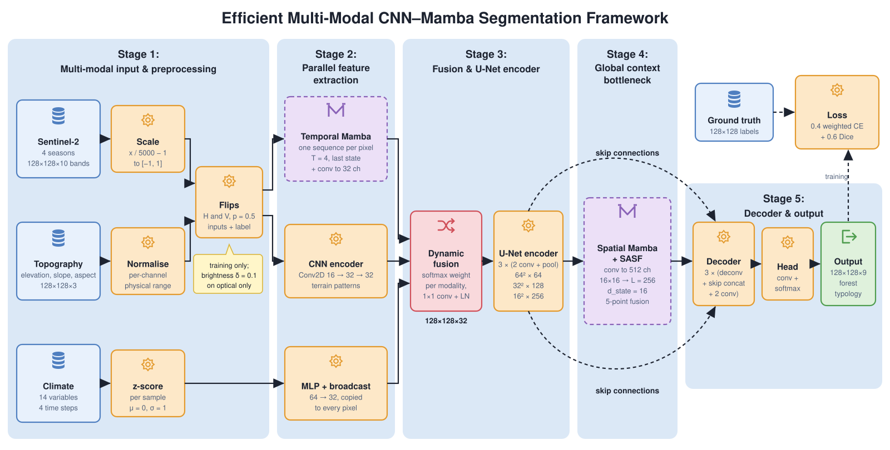

Multi-Modal CNN-Mamba for Forest Type Segmentation
=============
Welcome to the CNN-Mamba forest typology project main page!
This page is about how to run this software.

#### Setup

Python 3.10 to 3.12. TensorFlow publishes stable releases for a limited
range of Python versions; on a newer interpreter such as 3.14, pip finds only a
release candidate and `make install` stops. If your default `python3` is newer,
create the environment with a 3.12 interpreter (`python3.12 -m venv .venv`, or
`uv venv --python 3.12 --seed .venv` with [uv](https://docs.astral.sh/uv/)).
The test suite passes on Python 3.12 with TensorFlow 2.21.

The dependencies are listed in
[`requirements.txt`](requirements.txt) — TensorFlow 2.15 or newer, NumPy and
matplotlib, plus pytest and flake8 for the tests and style checks — and
`make install` installs them together with the package itself
(`pip install -r requirements.txt && pip install -e .`). A single GPU is enough
for training; with the default 128 shards per epoch the input pipeline streams
the data from Google Cloud Storage, so nothing has to be downloaded first.
Reading the bucket needs application-default credentials
(`gcloud auth application-default login`).

#### Install

```bash
python3.12 -m venv .venv && source .venv/bin/activate   # Python 3.10-3.12
make install                      # pip install -r requirements.txt && pip install -e .
```

#### Train

```bash
# Defaults: 128 training shards per epoch, 8 validation shards, batch size 16
make train
# or with explicit settings
python -m mamba_forest.train \
    --train-shards 128 --val-shards 8 --epochs 40 \
    --output-dir runs/mamba_forest
```

#### Evaluate

```bash
make eval
# or
python -m mamba_forest.evaluate \
    --weights runs/mamba_forest/best.weights.h5 --test-shards 64
```

#### Predict on Your Own Tiles

```bash
# Forest-type map per tile plus a table of class shares
make predict TILES=my_tiles OUT=predictions
```

#### Run Tests

```bash
make test                         # python -m pytest tests -q
```

#### Check Style

```bash
make lint                         # flake8, 88 columns
```

#### Clean the Project

```bash
make clean
```

The full usage guide, with every flag and the files each command writes, is in
[`docs/user.md`](docs/user.md).

----------------

User page
=============
Welcome to the CNN-Mamba forest typology project user main page!

This is a deep-learning project which has been completed by Yike Chen, Qianhua
Wan, Cherng Khai Hng and Jiawei Li as a deep-learning course project at the
Chinese University of Hong Kong, Shenzhen. We developed a forest type mapping
model for satellite time series: an efficient multi-modal CNN-Mamba framework
that combines Sentinel-2 optical time series, climate variables and elevation
data into pixel-level segmentation of forest types, evaluated on the ForTy v1
benchmark. It mainly contains two parts. The segmentation model comes with the
input pipeline that streams the dataset from Google Cloud Storage, the training
objective designed for the class imbalance of the task, and the training and
evaluation entry points; the prediction tool applies a trained model to your
own tiles and maps the forest types in them.

# Forest Type Segmentation Abstract

Accurate forest type classification is critical for environmental monitoring
and sustainable management. Distinguishing natural forest from planted forest
and tree crops, rather than merely separating "forest" from "non-forest", is
the part of the problem that matters for policy and the part that current
models are worst at [[1]](#ref-1). Formulated as pixel-level semantic segmentation,
it requires modelling spatial structure, seasonal dynamics and heterogeneous
information from several sensors at once, and multi-temporal, multi-modal
observations are known to improve forest mapping substantially [[1]](#ref-1).

This project proposes an efficient multi-modal CNN-Mamba framework. The model
combines convolutional encoders for local spatial feature extraction with
Temporal and Spatial Mamba blocks — selective state-space models that capture
long-range dependencies in linear time instead of the quadratic attention of a
transformer [[2]](#ref-2). A dynamic MLP-based fusion mechanism adaptively
integrates the modalities per sample, and a U-Net-style encoder-decoder
[[3]](#ref-3) with a Mamba bottleneck reconstructs high-resolution segmentation
maps. On the ForTy dataset [[1]](#ref-1), trained on only 12.5% of the available
data, the approach outperforms the UNet3D [[4]](#ref-4) and UTAE [[5]](#ref-5)
baselines and reaches competitive performance relative to MTSViT [[1]](#ref-1),
which shows its data efficiency under limited-resource settings.



The network has five stages: **(1)** each modality is normalised on its own
terms and the training tiles are flipped synchronously with their labels;
**(2)** the three modalities are encoded in parallel — a Temporal Mamba block
for the Sentinel-2 series, a convolutional stack for terrain and an MLP for
climate; **(3)** a dynamic fusion layer weights the modalities per sample and a
U-Net encoder downsamples the fused map to 16 × 16; **(4)** a Spatial Mamba
block with Structure-Aware State Fusion (SASF) models global context at the
bottleneck; **(5)** a decoder with skip connections restores full resolution
and a softmax head predicts one of nine classes per pixel, trained with a
weighted cross-entropy plus Dice objective.

## Dataset

[ForTy v1](https://console.cloud.google.com/storage/browser/forest_typology)
[[1]](#ref-1) is a public forest-typology benchmark of about 200,000 globally
sampled 128 x 128 pixel tiles, published as 1024 TFRecord shards per split. Samples are partitioned
into geographically distinct 100 x 100 km blocks in an 8:1:1 ratio, so the
train, validation and test splits do not share spatial autocorrelation. Each
tile provides:

- **Sentinel-2 optical imagery** [[6]](#ref-6) — 10 bands at 10-20 m resolution, as
  four seasonal composites.
- **Climate variables** — 14 TerraClimate [[7]](#ref-7) monthly metrics at ~4 km
  resolution.
- **Topographic data** — FABDEM [[8]](#ref-8) elevation, slope and aspect at 30 m
  resolution.
- **Segmentation labels** — a per-pixel class index over nine land-cover
  classes, of which the three forest types (natural forest, planted forest,
  tree crops) are the classes of interest.

Nothing is downloaded up front: the pipeline streams a random subset of shards
per epoch straight from Google Cloud Storage, which keeps an epoch to a few
thousand tiles and makes single-GPU experiments possible.

## Preprocessing

Because the modalities have different physical units and ranges, each is
normalised on its own terms: Sentinel-2 reflectance is scaled to [-1, 1] with a
factor of 5000, elevation is centred at 2000 m and scaled by 3000, slope by 45
degrees and aspect by 180 degrees, and each climate variable is z-scored over
the time axis of the sample. The integer masks are one-hot encoded to
128 x 128 x 9 for the categorical objective.

Augmentation is applied to the training split only. Satellite imagery is
acquired from nadir, so land-cover classes are invariant to mirroring:
horizontal and vertical flips are each applied with probability 0.5, drawn once
per sample and applied synchronously to the optical series, the elevation map
and the label mask so that the pixel-wise correspondence is preserved.
Brightness jitter with a maximum delta of 0.1 simulates illumination and
atmospheric variation and is applied to the optical modality only, since
perturbing elevation or climate would change the physical meaning of those
measurements instead of modelling sensor noise. Shards are interleaved in
parallel and prefetched with `AUTOTUNE` so the input pipeline keeps up with the
accelerator.

## Model

Here is an introduction to the five stages the network is built from.

### Parallel Modality Encoders

The three modalities are encoded in parallel, each in the way that suits its
structure. The optical time series of shape `[B, T, H, W, C]` is folded into
one sequence per spatial location, `[B*H*W, T, C]`, so the temporal block sees
the four seasons of a single pixel and the spatial structure is left
untouched. A **Temporal Mamba block** [[2]](#ref-2) then compresses the phenological
dynamics into a compact representation: a separable convolution extracts
short-range temporal patterns, small learned projections generate the
input-dependent SSM parameters that govern how much of the state is kept or
overwritten at each step, and the output is gated and projected back to the
channel width. The last state is reshaped back to `[B, H, W, C]`, giving a
temporally enriched optical feature map.

Elevation is treated as a spatial modality: a stack of 2D convolutions with
growing channel width projects the terrain map into the shared feature space
while preserving resolution. Climate variables are low-dimensional and have no
spatial extent, so a small MLP turns them into a modality embedding that is
broadcast over space to `[B, H, W, d_model]`, letting the climatic context
influence every pixel at negligible cost.

### Dynamic Multi-Modal Fusion

Instead of concatenating the three feature maps, the model computes fusion
weights from their content. Each modality is pooled to a global descriptor, the
descriptors are concatenated and passed through a lightweight MLP, and a
softmax produces one weight per modality *per sample*. The weights are
broadcast spatially, applied to their feature maps, and the weighted sum is
refined by 1 x 1 convolutions and layer normalisation. A cloudy tile can
therefore lean on terrain and climate, while a clear tile leans on the optical
series.

### U-Net Encoder

The hierarchical encoder is a U-Net-style [[3]](#ref-3) downsampling path of three
stages, following the use of U-Net encoders around Mamba blocks in
Mamba-UNet [[9]](#ref-9).
Each stage applies two 3 x 3 convolutions with ReLU activation and dropout,
followed by 2 x 2 max pooling. Starting from the fused map at 128 x 128, the
spatial resolution goes 128 -> 64 -> 32 -> 16 while the channel width grows
32 -> 64 -> 128 -> 256, so the encoder learns increasingly abstract spatial
representations while keeping the hierarchy available for the decoder.

### Spatial Mamba Bottleneck with SASF

At the 16 x 16 bottleneck the feature map is projected to 512 channels and
flattened into a sequence of length 256. A selective state-space model with
`d_state = 16` scans that sequence [[2]](#ref-2), so every patch can reach every
other patch with linear rather than quadratic cost — a "global eye" that
connects disjoint forest patches across the tile, as Mamba does for global
context in medical image segmentation [[9]](#ref-9).

Flattening a 2D map into a 1D sequence loses vertical adjacency: two pixels
that are neighbours in the image are a full row apart in scan order.
**Structure-Aware State Fusion (SASF)**, introduced in Spatial-Mamba
[[10]](#ref-10), repairs this. After the scan the sequence is reshaped back to
16 x 16 and the state of each pixel is fused over its five-point neighbourhood
— the pixel itself and its up, down, left and right neighbours:

$$
h_{t,\mathrm{fused}} = h_t + \sum_{n \in \mathcal{N}} w_n\, h_n ,
$$

with weights learned per position and channel. This re-introduces a 2D
inductive bias, so the linear sequence model stays aware of the physical
spatial structure.

### Multi-Stage Decoder

The decoder reconstructs 16 -> 32 -> 64 -> 128 in three stages. Each begins
with a transposed convolution of stride 2, concatenates the matching encoder
feature map — `enc2`, `enc1` and the fused map respectively — and refines the
result with two 3 x 3 convolutions with dropout. The skip connections return
the fine spatial detail lost to pooling. A convolutional head with a softmax
activation produces the per-pixel class probabilities at the full 128 x 128
resolution; the head is kept in float32 so the softmax and the loss stay stable
under mixed-precision training.

## Training

The objective is a convex combination of a weighted categorical cross-entropy
and a Dice loss,

$$
\mathcal{L} = \alpha\,\mathcal{L}_{\mathrm{WCCE}} + (1-\alpha)\,\mathcal{L}_{\mathrm{Dice}},
\qquad
\mathcal{L}_{\mathrm{Dice}} = 1 - \frac{2\,\lvert A \cap B\rvert}{\lvert A\rvert + \lvert B\rvert},
\qquad \alpha = 0.4,
$$

which puts 40% of the weight on pixel-wise supervision and 60% on region-level
overlap. The cross-entropy term uses label smoothing [[11]](#ref-11) of 0.05 and a
per-class weight vector, `[1.0, 1.0, 3.0, 1.0, 1.0, 1.2, 1.0, 2.0, 1.0]`, that
raises the cost of the rare classes, planted forest most of all. The Dice term
[[12]](#ref-12) is computed per class and averaged over the classes present in the
batch, so a class that appears in neither the labels nor the prediction cannot
score a free perfect overlap.

Parameters are optimised with AdamW [[13]](#ref-13), weight decay 5e-3, from an
initial learning rate of 2e-4 under a cosine decay [[14]](#ref-14) down to 10% of it.
Gradients are clipped to a global norm of 1.0, and mixed-precision training
[[15]](#ref-15) keeps the compute-heavy operations in float16 with dynamic loss
scaling while weights and the output head stay in float32, which cuts memory
use and speeds up training without affecting the result. Each epoch streams 128
randomly chosen training shards in batches of 16.

## Results

All numbers are F1 in percent on the ForTy v1 test split: **Overall** is the
macro F1 over the nine classes, **Forests** the mean F1 of the three forest
types, and **N**, **P** and **TC** the F1 of natural forest, planted forest and
tree crops.

| Model | Overall | Forests | N | P | TC |
|---|---:|---:|---:|---:|---:|
| UNet3D [[4]](#ref-4) | 32.4 | 24.2 | 56.2 | 7.5 | 8.8 |
| UTAE [[5]](#ref-5) | 49.4 | 37.7 | 71.4 | 13.8 | 27.8 |
| MTSViT [[1]](#ref-1) | 81.1 | 74.9 | 82.8 | 62.9 | 78.9 |
| **CNN-Mamba (this repository)** | **56.89** | **48.81** | **64.67** | **27.64** | **54.12** |

The baseline numbers are those reported with the benchmark [[1]](#ref-1) and are
trained on the full training split; this model is trained on
128 of the 1024 shards, about 12.5% of the data. Under that budget it improves
on UNet3D and UTAE in every column, with the clearest gains on the two classes
the benchmark finds hardest — planted forest and tree crops — and stays behind
MTSViT, which sees eight times as much training data. The combination of a
weighted cross-entropy with the Dice term is what makes those rare classes
trainable: with a plain unweighted cross-entropy the validation metrics swing
between epochs and the under-represented classes collapse into natural forest
and other vegetation.

More detail, including the training configuration and how to reproduce the
numbers, is in [`results/README.md`](results/README.md).

# Forest Map Prediction Abstract

The prediction tool applies a trained model to imagery of your own region. The
benchmark says how good the model is; this is how you point it at your own
tiles.

## Mapping Your Own Region

Give it a directory of tiles and it returns a forest-type map per tile
plus a table of what is in them:

```bash
make predict TILES=my_tiles OUT=predictions
```

Each tile is one `.npz` file holding three unnormalised arrays — `s2`
`(4, H, W, 10)` Sentinel-2 seasonal composites, `elevation` `(H, W, 3)` in
metres and degrees, and `climate` `(4, 14)` — with `H = W` divisible by 8.
`predict.py` applies exactly the same normalisation as the training pipeline,
so there is no second copy of the scaling constants to drift.

You get back `<tile>_class_map.npy` with the nine class indices per pixel, an
optional colour-coded PNG, and `predictions.csv` with the pixel share of every
class per tile plus the combined `forest_share`. That last table is what turns
the model into an answer: average the shares over the tiles covering a
concession to get its composition, or subtract the class maps of two years to
separate *natural forest converted to tree crops* from *natural forest cleared
to bare ground* — a distinction a binary forest mask cannot make, because in
the first case the canopy is still there.

The full contract — array shapes, units, band order, what each output file
holds, and how to retarget the model to a different taxonomy — is in
[`docs/apply.md`](docs/apply.md).

----------------

Developer page
=============
Welcome to the CNN-Mamba forest typology project developer main page!

----------------
## Abstract

This is a deep-learning project which has been completed by Yike Chen, Qianhua
Wan, Cherng Khai Hng and Jiawei Li as a deep-learning course project at the
Chinese University of Hong Kong, Shenzhen. We developed a forest type mapping
model for satellite time series: an efficient multi-modal CNN-Mamba framework
that combines Sentinel-2 optical time series, climate variables and elevation
data into pixel-level segmentation of forest types, evaluated on the ForTy v1
benchmark. It mainly contains two parts. The segmentation model comes with the
input pipeline that streams the dataset from Google Cloud Storage, the training
objective designed for the class imbalance of the task, and the training and
evaluation entry points; the prediction tool applies a trained model to your
own tiles and maps the forest types in them.

For more information about the software, select the following pages.

----------------
## [Programming Reference](docs/reference.md)

The repository is organised as a small installable package plus two entry
points. `src/mamba_forest/` holds the TensorFlow implementation: `data.py`
streams and preprocesses ForTy v1, `layers.py` holds the three building blocks
(the selective state-space block, SASF and the dynamic fusion layer),
`model.py` assembles them into the segmentation network, `losses.py` defines
the training objective, and `train.py` and `evaluate.py` are the command-line
entry points, with `predict.py` applying a checkpoint to your own tiles.
`tests/` covers the blocks, the network and the objective, and `docs/` holds
the pages below.

The main code of the project is laid out as follows; every public class and
function, its arguments and the tensor shapes it expects are on the
Programming Reference page, and the path a batch takes through the package is
on the [Developer Overview](docs/developer.md) page.

```
.
├── src/mamba_forest/         # TensorFlow implementation
│   ├── data.py               # ForTy v1 streaming, normalisation, augmentation
│   ├── layers.py             # Mamba block, SASF, dynamic multi-modal fusion
│   ├── model.py              # CNN-Mamba U-Net segmenter
│   ├── losses.py             # weighted cross-entropy + Dice objective
│   ├── train.py              # training loop, metrics, checkpointing
│   ├── evaluate.py           # test-split evaluation
│   └── predict.py            # apply a checkpoint to your own tiles
├── tests/                    # unit tests for the blocks, the network, the objective
├── docs/                     # developer documentation and figures
├── scripts/plot_results.py   # training curves from the metrics CSV
├── results/                  # benchmark numbers and run configuration
├── requirements.txt          # Python dependencies
├── pyproject.toml            # package metadata (pip install -e .)
└── Makefile                  # install / train / eval / predict / test / lint
```

## [High-level Design](docs/design.md)

In this project, three properties of the task shape the architecture.

1. The signal is temporal but the sequence is short: telling planted forest
   from natural forest depends on how the canopy changes between seasons, and
   each sample has only four composites. A selective state-space block models
   that sequence in linear time.
2. The modalities are heterogeneous: optical imagery is a spatial time series,
   terrain a static map and climate a few numbers per season. Each gets its
   own encoder, and a content-dependent fusion layer weights them per sample.
3. The classes of interest are rare: planted forest and tree crops cover under
   20% of the labelled pixels, so the objective adds a region-level Dice term
   and class weights to the cross-entropy.

The design page gives the equations of the selective state-space recurrence,
the reasoning behind the fusion and the bottleneck, and the data flow diagram.

## [Coding Style](docs/coding.md)

We followed the [Google Python Style Guide](https://google.github.io/styleguide/pyguide.html)
with the conventions below.

- Two-space indentation, 80 columns for code and prose and 88 as the hard
  limit, checked with `make lint`.
- Every public class and function has a docstring that states its intent, its
  arguments and the tensor shapes it expects and returns, written as
  `[B, T, H, W, C]`.
- Comments explain intent rather than mechanics, and anything a future reader
  would find surprising gets a comment.
- Arguments are validated where a wrong value would otherwise fail deep inside
  a framework call, randomness comes from a single `--seed` flag, and every
  configuration is saved next to its checkpoints.
- No credentials, absolute paths or machine-specific settings in the source;
  the dataset root, the output directory and every hyper-parameter are flags
  with defaults.

## [Common Tasks](docs/tasks.md)

This page gives you the recipes for the changes people most often want to make.

1. Add a fourth modality, such as the Sentinel-1 radar ForTy v1 also ships:
   read and normalise it in `data.py`, give it an encoder in `model.py`, and
   raise the number of modalities in the fusion layer.
2. Change the capacity of the network with `--d-model` and the channel
   schedule of the encoder and decoder.
3. Change the objective through `ComboLoss`: `--combo-alpha`,
   `--no-class-weights` or a new class-weight vector.
4. Run on a different dataset by adapting the data module, the class list and
   the colour map.
5. Train on the full dataset with `--train-shards 1024`.

## [Testing](docs/testing.md)

The suite runs on CPU in under a minute and needs neither a GPU nor the
dataset: every test builds a small model on synthetic tensors.

```bash
make test                          # python -m pytest tests -q
```

- `tests/test_layers.py` checks that the Mamba block preserves shape, is causal
  and carries information through its state, that SASF stays local, and that
  the fusion layer uses every modality.
- `tests/test_model.py` checks that the network returns valid probabilities at
  the input resolution, that every modality and the season order change the
  prediction, and that gradients are finite.
- `tests/test_losses.py` checks that the loss ranks predictions correctly,
  weights the classes exactly as configured, excludes absent classes from the
  Dice term and rejects invalid settings.

The data module talks to Google Cloud Storage, so it is exercised by running a
training job rather than by a unit test.

----------------
## References

1. <a id="ref-1"></a>Y. Jiang and M. Neumann. Not every tree is a forest:
   Benchmarking forest types from satellite remote sensing. 2025.
   [arXiv:2505.01805](https://arxiv.org/abs/2505.01805)
2. <a id="ref-2"></a>A. Gu and T. Dao. Mamba: Linear-time sequence modeling
   with selective state spaces. 2023.
   [arXiv:2312.00752](https://arxiv.org/abs/2312.00752)
3. <a id="ref-3"></a>O. Ronneberger, P. Fischer and T. Brox. U-Net:
   Convolutional networks for biomedical image segmentation. *MICCAI*, 2015.
   [arXiv:1505.04597](https://arxiv.org/abs/1505.04597)
4. <a id="ref-4"></a>Ö. Çiçek, A. Abdulkadir, S. S. Lienkamp, T. Brox and
   O. Ronneberger. 3D U-Net: Learning dense volumetric segmentation from sparse
   annotation. *MICCAI*, 2016. [arXiv:1606.06650](https://arxiv.org/abs/1606.06650)
5. <a id="ref-5"></a>V. Sainte Fare Garnot and L. Landrieu. Panoptic
   segmentation of satellite image time series with convolutional temporal
   attention networks. *ICCV*, 2021.
   [arXiv:2107.07933](https://arxiv.org/abs/2107.07933)
6. <a id="ref-6"></a>M. Drusch et al. Sentinel-2: ESA's optical high-resolution
   mission for GMES operational services. *Remote Sensing of Environment* 120,
   2012. [doi:10.1016/j.rse.2011.11.026](https://doi.org/10.1016/j.rse.2011.11.026)
7. <a id="ref-7"></a>J. T. Abatzoglou, S. Z. Dobrowski, S. A. Parks and
   K. C. Hegewisch. TerraClimate, a high-resolution global dataset of monthly
   climate and climatic water balance from 1958–2015. *Scientific Data* 5,
   2018. [doi:10.1038/sdata.2017.191](https://doi.org/10.1038/sdata.2017.191)
8. <a id="ref-8"></a>L. Hawker, P. Uhe, L. Paulo, J. Sosa, J. Savage, C. Sampson
   and J. Neal. A 30 m global map of elevation with forests and buildings
   removed. *Environmental Research Letters* 17, 2022.
   [doi:10.1088/1748-9326/ac4d4f](https://doi.org/10.1088/1748-9326/ac4d4f)
9. <a id="ref-9"></a>Z. Wang, J.-Q. Zheng, Y. Zhang, G. Cui and L. Li.
   Mamba-UNet: UNet-like pure visual Mamba for medical image segmentation.
   2024. [arXiv:2402.05079](https://arxiv.org/abs/2402.05079)
10. <a id="ref-10"></a>C. Xiao, M. Li, Z. Zhang, D. Meng and L. Zhang.
    Spatial-Mamba: Effective visual state space models via structure-aware
    state fusion. *ICLR*, 2025. [arXiv:2410.15091](https://arxiv.org/abs/2410.15091)
11. <a id="ref-11"></a>C. Szegedy, V. Vanhoucke, S. Ioffe, J. Shlens and
    Z. Wojna. Rethinking the Inception architecture for computer vision.
    *CVPR*, 2016. [arXiv:1512.00567](https://arxiv.org/abs/1512.00567)
12. <a id="ref-12"></a>F. Milletari, N. Navab and S.-A. Ahmadi. V-Net: Fully
    convolutional neural networks for volumetric medical image segmentation.
    *3DV*, 2016. [arXiv:1606.04797](https://arxiv.org/abs/1606.04797)
13. <a id="ref-13"></a>I. Loshchilov and F. Hutter. Decoupled weight decay
    regularization. *ICLR*, 2019. [arXiv:1711.05101](https://arxiv.org/abs/1711.05101)
14. <a id="ref-14"></a>I. Loshchilov and F. Hutter. SGDR: Stochastic gradient
    descent with warm restarts. *ICLR*, 2017.
    [arXiv:1608.03983](https://arxiv.org/abs/1608.03983)
15. <a id="ref-15"></a>P. Micikevicius et al. Mixed precision training. *ICLR*,
    2018. [arXiv:1710.03740](https://arxiv.org/abs/1710.03740)

## Acknowledgments

The ForTy v1 benchmark and the baseline results are from Jiang and Neumann
[[1]](#ref-1), Google DeepMind.

## License

MIT — see [LICENSE](LICENSE).
